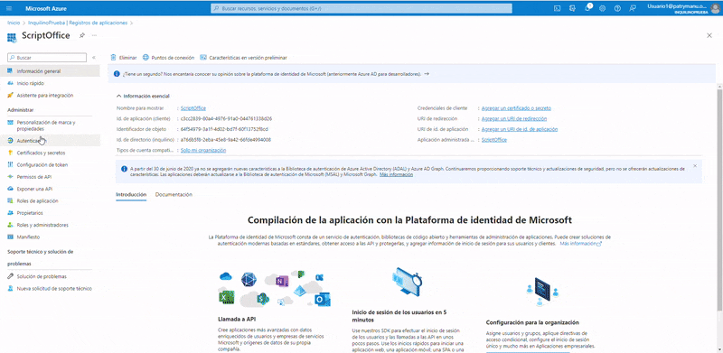

# office365-email-script

Script se conecta a un buzón de correos de Office 365, recupera correos filtrados y descarga los ficheros adjuntos en un directorio indicado por el usuario.

## Puesta en marcha

El script usa la [API Microsoft Graph](https://learn.microsoft.com/es-es/graph/overview) para acceder a los correos del usuario. Para usar la aplacaión hay que seguir los siguientes pasos:

1. __Registrar la apliación__: Nuestra aplicación necesita estar registrada para poder usar la API de Microsoft. Para ello, si somos administradores de nuestra cuenta de Microsoft, accedemos a Azure Active Directory en el [panel de Azure](https://portal.azure.com/?feature.msaljs=false#home) y seleccionamos en __Administrar->Registros de apliaciones__ y, en la nueva ventana le asignamos el nombre que más nos convenga y finalmente, pulsamos en "Registrar".

    <p align="center">
    
    </p>

    Una vez hecho esto, en "Información esencial" obtendremos un __Id. de aplicación (cliente)__ que habrá que introducir en el archivo "config.json".

2. __Habilitar permisos__: En la sección de Autenticación de nuestra aplicación, en la configuración avanzada habilitamos la opción "Permitir flujos de clientes públicos". A continuación, nos dirigimos a "Permisos de API", agregamos un permiso en Microft Graph de tipo __Permisos delegados__, añadimos el permiso de __Mail.Read__ y por último, seleccionamos en "Conceder consentimiento de administrador para {NombreInquilino}".

<p align="center">

</p>

## Inicio rápido
En esta sección se muestra cómo usar el script si __no tenemos permisos de administrador__ o queremos hacer una prueba.

La guía de inicio rápido de Microsoft Graph permite registrar una app automáticamente con el nombre "Graph Python quick start" y obtener un "client_id" y registrar los permisos necesarios sin necesidad de ser administradores.

1. Nos dirigimos a la siguiente url: https://developer.microsoft.com/en-us/graph/quick-start.

2. Selccionamos el lenguaje Python y pulsamos en obtener "Get a client ID".


## Inicio del script
Para este proyecto necesitamos python3.6 o superior.

- Clonamos este repositorio
    ```
    git clone https://github.com/manuel-anton-satec/office365-email-script.git
    cd office365-email-script
    ```

- Instalamos las dependencias
    `pip install -r requirements.txt`

- Antes de iniciar el script hay que definir en el archivo de configuración las credenciales de la app (client_id), usario y contraseña de la cuenta para acceder a su buzón y también un directorio donde guardar los archivos adjuntos (attachmentsDir).

- Iniciamos el script.
`python main.py`